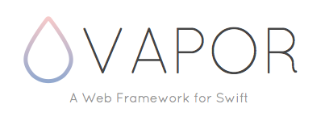

#
Swift Server Side

Partiamo un attimo dall'inizio...

##2014
 Apple presenta durante la conferenza mondiale degli sviluppatori [wwdc2014](https://developer.apple.com/videos/play/wwdc2014/402/) un nuovo linguaggio di programmazione destinato a sostituire completamente con gli anni il precedente linguaggio (Objective C) utilizzato fino a quel momento per lo sviluppo di programmi all'interno del suo ecosistema (MacOS, iOS, TvOS, watchOS). Il nome scelto per il nuovo linguaggio è **SWIFT** (dall'inglese "rondine", "rapido").

Per consentirne l'adozione rapida, *swift* viene sin da subito concepito per essere utilizzato a fianco dei vecchi progetti scritti in  Objective C permettendo la coesistenza in uno stesso progetto sia di Objective C che di *Swift*. Ma questo non è l'unico vantaggio per cui Apple consiglia sin da subito l'uso di questo linguaggio.

 
######*Photo credit: Shubhendu Trivedi via [Onionesque Reality] (https://onionesquereality.wordpress.com/2014/01/29/the-evolution-of-programming-languages/)*

Swift può ben definirsi il *risultato di una attenta selezione darwiniana* (in cui l'uomo recita la parte della natura) che è avvenuta negli anni nel campo informatico dei linguaggi di programmazione ...

Da questo confuso e complicato ambiente, fatto da oceani di righe di codice, vulcanici compilatori, tentativi più o meno riusciti con cui l'uomo ha sin dall'inizio tentato di generare nuove grammatiche che gli consentissero di ottimizzare le sue comunicazioni con le macchine, la selezione darwiniana informatica negli anni ha elevato a soluzioni migliori quelle che attualmente caratterizzano i più recenti e moderni linguaggi di programmazione e *Swift* non è stato da meno entrando in maniera *"rapida"* e dirompente in questo club smart prendendo il meglio delle idee da "Rust", "Haskell", "Ruby, Python, C#, CLU [[2](http://nondot.org/sabre/)]

######*Screenshot via [stackoverflow](http://stackoverflow.com/research/developer-survey-2016#technology-most-loved-dreaded-and-wanted)*

Ma quali caratteristiche darwiniane ha portato con se *Swift* e che secondo le ultime statistiche di stackoverflow (noto sito per tecnici del settore di Q&A) è sempre più prediletto tra le scelte degli sviluppatori di tutto il mondo [[1]](http://stackoverflow.com/research/developer-survey-2016#technology-most-loved-dreaded-and-wanted)  

##Less code

######*Photo credit: via [quotesgram](http://www.walthampton.com/wp-content/uploads/2014/05/why_less_is_more.png)*

Il codice con swift diventa più conciso e con una sintassi più naturale per l'uomo che lo rende più facile da leggere e da manutenere. L'inferred type del compilatore rende il codice scritto dallo sviluppatore più pulito e meno soggetto agli errori. Less code significa anche eliminazione del semanticamente insignificante ; (punto e virgola) che per anni ha caratterizzato la natura dei codici compilati.

Tutto ciò e molto altro, senza scendere troppo nel particolare (si potrebbero citare i Generics, le tuple etc), rende swift un linguaggio facile e divertente da usare per lo sviluppatore che può, a seconda delle esigenze, utilizzare paradigmi classici di programmazione come l'imperative programming o quelli un pò più "esotici" come il functional programming.

##Progettato per la sicurezza

 
######*Photo credit: via [meme generator](http://es.memegenerator.net/instance/29472476)*

Swift elimina intere classi di codice non sicuro. Le variabili devono essere sempre inizializzate  e tipizzate prima dell'uso e di default gli oggetti non possono mai essere **nil** (il compilatore ne ferma la compilazione). Possono esserci però situazioni dove un valore **nil** è valido ed appropriato. Per queste situazioni, Swift introduce il concetto di *Optional* che forza lo sviluppatore ad inserire nella sintassi un "?" o un "!" per indicare al compilatore che si è a conoscenza del problema e si è in grado di gestirne le conseguenze in modo sicuro. Tutto ciò e molto altro rende più difficile tutta una pletora di problemi come i crash a runtime se lo sviluppatore segue i dettami del linguaggio.

##Veloce

######*Photo credit: notdrawntoscale via [imgur](http://imgur.com/gallery/w8VNE8x)*

Sin dall'inizio Swift è stato progettato per essere "rapido" e veloce. Sfruttando il framework di compilazione LLVM di Apple ad alte prestazioni (che estende quello opensource rilasciato dall'università dell'Illinois nel 2000), il codice swift è trasformato in linguaggio macchina  ottimizzato per gli hardware più moderni

##Playground

 
######*Photo credit: Apple via [Swift Blog](https://developer.apple.com/swift/blog/?id=35)

Una delle novità assolute di questo linguaggio è la presenza di uno strumento chiamato Playground che permette agli sviluppatori di vedere istantaneamente il risultato del codice senza passare dal ciclo classico di compilazione. Infatti il codice scritto con Playground è tradotto in linguaggio macchina al volo e ciò permette un certo grado di interattività tra quello che si scrive e ciò che il codice effetivamente produce durante l'esecuzione. I Playgrounds possono essere creati sia all'interno di un progetto esistente sia come documenti Standalone,  permettendone quindi l'utilizzo sia in ambito professionale, sia per il testing del codice al volo e anche per motivi didattici.
Le sue caratteristiche infatti, alcune delle quali elencate precedentemente come il less code o l'avvicinamento al linguaggio naturale lo rendono, meglio di altri linguaggi, ideale strumento di apprendimento alla programmazione.
  
##Open Source
Annunciandolo un anno dopo la sua presentazione, durante il WWDC 2015 Apple rilascia il suo nuovo linguaggio come Open Source, dando così da un lato la possibilità alla comunità di sviluppatori di tutto il mondo di confrontarsi e partecipare alla sua crescita creando un sistema di contributing fatto di pull request, mailing list, reporting bugs e partecipazione diretta nel processo di evoluzione, dall'altro consentendo al linguaggio di essere utilizzato nei più disparati ambiti di applicazione anche quelli che non sono direttamente controllati da Apple. 

Al processo di evoluzione della nuova versione Swift 3 hanno partecipato centinaia di sviluppatori da tutto il mondo. I dati presenti su github parlano chiaro:

Centinaia di contributi, come spiega Chris Lattner Senior Director del Developer Tools Department di Apple [[3]](https://lists.swift.org/pipermail/swift-evolution/Week-of-Mon-20160725/025676.html) in uno degli ultimi messaggi in mailing list in occasione del giro di boa di swift 3 verso swift 4, significano però anche un alto rischio di perdere per strada alcuni obiettivi, ma grazie al fatto che dietro al processo apparentemente caotico dei processi opensource ci sia sempre l'occhio vigile di una grande azienda come la Apple che suggerisce alcuni dei path principali da perseguire rispetto ad altri, questo processo si traduce in concretezza oltre che essere un ottimo esempio di come l'opensource può coesistere con il closed source (ricordiamo che i vari framework di Apple rimangono e rimarranno pur sempre closed source ma la comunità open sta via via sviluppando librerie per lo swift server-side).

#Nuovi Percorsi
Dal momento in cui Swift è stato rilasciato open source e cross-platform, molti team si sono sbizzarriti per rendere Swift non solo un linguaggio di programmazione orientato allo sviluppo in ambiente Apple ma anche un vero e proprio linguaggio Full Stack da utilizzare anche in altri ambiti non legati direttamente ad ambiente Apple. 

Esempi sempre più numerosi si stanno affacciando nel panorama in ambito web. Stanno infatti nascendo diversi framework che permettono di sviluppare interi server web e framework per il backend. Less code, sicurezza, velocità d'esecuzione stanno permettedno a Swift di imporsi anche in ambiti in qualche modo legati al processo di sviluppo delle apps, e l'interessamento di grandi Big del settore in questa evoluzione, come IBM, ne conferma la serietà delle intenzioni. Quello di cui parleremo sono tecnologie nuove, ancora poco affrontate e in via di sviluppo ma molto promettenti per il futuro. Ma la prima domanda che forse già vi state facendo da un pezzo  è:
#Perchè utilizzare Swift lato server ?

######*Photo credit: via [meme generator](http://es.memegenerator.net/instance/53434671)*

Esistono già linguaggi creati specificamente per far questo. Pensiamo a Ruby, Go, Php etc.. abbiamo anche già a disposizione numerosi linguaggi cross-platform, pensiamo a Python, C#, Java. Perchè Swift dovrebbe essere *"migliore"* di questi linguaggi che hanno già una maturità e una base di installazioni ragguardevoli?
Beh, perchè semplicemente qui non si vuole sottolineare un discorso di un *"linguaggio migliore"* rispetto a qualche altro. Come sappiamo non esiste un linguaggio migliore in assoluto. Ogni linguaggio ha le sue specificità, ed è stato progettato per un certo compito. Una delle utilità rispetto agli altri linguaggi è per lo sviluppatore iOS che va via via trasformandosi da uno sviluppatore mobile ad uno sviluppatore full-stack mono linguaggio. Chi sviluppava applicazioni iOS non dovrà più switchare da un linguaggio all'altro. D'altro campo questa espansione di swift è utile anche per gli sviluppatori web che adesso hanno la possibilità di imparare ed utilizzare un linguaggio che va trasformandosi in un linguaggio full-stack  Qui si vuole sottolineare il fatto che un linguaggio come swift, nato con un certo scopo, grazie a certe sue caratteristiche peculiari, sta pian piano uscendo dal suo guscio per cui è stato creato e si sta attestando in ottime posizioni in certi campi di applicazione. Per quale motivo?

##Compromesso
Se comparato ad altri linguaggi, Swift è stato progettato sin dall'inizio per essere un giusto compromesso tra Produttività e Performance.

Alcuni linguaggi di programmazione infatti sono ideali per la produttività degli sviluppatori ma girano lentamente. Altri sono veloci ma per lo sviluppatore risultano difficili da scrivere velocemente.
Swift racchiude in se entrambe le caratteristiche, veloce da scrivere e veloce in fase di run. Produttività e Performance. Dati alla mano allora parliamo di:

##Prestazioni
Dopo il rilascio delle istruzioni per sistemi Linux, alcuni si sono spinti nei test benchmark più disparati.
Uno dei più semplici benchmark fa uso dell'Apache HTTP server benchmarking tool **ab**.

######*Photo Credit: Clay Smith via [SpeekerDeck] (https://speakerdeck.com/smithclay/server-side-swift-with-docker-and-kubernetes) 

Come si può apprezzare da una delle slide che [presentazione](https://speakerdeck.com/smithclay/server-side-swift-with-docker-and-kubernetes) Clay Smith, Ingegnere Software, ha presentato allo Swift Mission Meetup del 2016, il server Swift Vapor è nettamente più performante della controparte in nodejs.

In comparazioni tra Go, NodeJS e Rust, Swift risulta molto spesso più performante dei rivali:

[Qui](https://grigio.org/go-vs-node-vs-rust-vs-swift/) nel classico test della serie di fibonacci (chi vuole approfondire può seguire il link), Swift risulta essere quasi il doppio più veloce di Rust, molte volte piu veloce di nodejs e Go.
 
######Photo credit: via [grigio.org](https://grigio.org/go-vs-node-vs-rust-vs-swift/)

[In un altra comparazione](https://medium.com/@qutheory/server-side-swift-vs-the-other-guys-2-speed-ca65b2f79505#.at98s2bjs) che esamina una delle più comuni attività di un framework web ossia l'SQLite Fetch (ma nel link si trovano altri semplici test usuali per un server web), Swift ( o meglio il framework web Swift Vapor in questo caso) è comparato ad altri linguaggi sia interpretati che compilati (tutti insieme appassionatamente 👨‍👩‍👧‍👧). Dai grafici che ne vengono fuori da queste analisi è possibile apprezzarne di nuovo le prestazioni: come si evince dai tets, Swift risulta essere ben 10 volte più veloce degli altri framework testati e ha tutte le possibilità per detronare i suoi più prossimi rivali, come Go e nodejs, in quanto il compilatore in ambiente Linux (dove sono stati eseguiti questi test) non è ancora completamente ottimizzato per questo ambiente.

######Photo credit: via [qutheory](https://medium.com/@qutheory/server-side-swift-vs-the-other-guys-2-speed-ca65b2f79505#.at98s2bjs)

##Un unico linguaggio per incatenarli tutti

NodeJs è salito in popolarità perchè consente ai "full-stack developers" di lavorare sia sul frontend che sul backend delle loro web apps. Ciò consente ai team di [iterare](http://searchsoftwarequality.techtarget.com/definition/iteration) più velocemente e questo spesso porta a prodotti di maggior successo. Swift, allo stesso modo di nodejs, grazie alle caratteristiche viste precedentemente diminuisce il tempo di iterazione per i team che lavorano sullo sviluppo mobile.
Un'altra importante considerazione è che utilizzandolo sia su server che su mobile è possibile sfruttare gli stessi modelli per la parte di networking, senza necessariamente doverli riscrivere da linguaggio a linguaggio.

#I Principali Framework Web Swift attuali

Esistono attualmente decine di framework server-side Swift più o meno seguiti e supportati. Alcuni sono nati dalla passione di sviluppatori indipendenti, altri da Team di sviluppo che stanno iniziando a fondare il loro core business su questa materia, altri che hanno abbracciato l'idea di uno Swift lato server sin da subito come IBM. I framework più popolari che stanno salendo attualmente alla ribalta sono: 
#Perfect

**PERFECT** è stato il primo a posizionarsi sulla scena dei framework swift lato server. E' stato progettato da Kyle Jessup il creatore del linguaggio di programmazione [Lasso](https://en.wikipedia.org/wiki/Lasso_(programming_language)) e si può dire che è stato costruito da qualcuno con una profonda conoscenza del backend web. Il Team di Perfect ha raccolto 1,2M$ in finanziamenti con l'intento di far crescere e migliorare sempre di più il framework

#Vapor

Tra i framework più popolari su github, [**VAPOR**](http://qutheory.io) è il mio preferito ed è un ottimo starting point per chiunque si stia affaciando allo swift server side.

Vapor è costruito su Swift 3, ha una buona documentazione e si ispira al noto framework php Laravel (c'è addirittura un alter-ego di artisan tool che è il vapor tool). Al momento al progetto lavorano in full-time due sviluppatori del team di **Qutheory** (startup di New Jork di cui Tenner Nelson è uno dei fondatori) oltre ai numerosi contributors di github.
Lo stesso sito che ne descrive le caratteristiche gira su vapor server framework

 
#Kitura

Il terzo in questa lista è [**KITURA**](http://www.ibm.com/cloud-computing/bluemix/swift/it-it/) di IBM. 

IBM sta investendo molte risorse nel rendere Swift il prossimo linguaggio enterprise dopo Java e Kitura è parte di questo sforzo. È stato presentato [nell'ultimo WWDC16](https://developer.apple.com/videos/play/wwdc2016/415/) ed alcuni sviluppatori del team di **KITURA** provengono dal team che mantiene Express.js per cui se si ha familiarità con Express, KITURA risulterà abbastanza familiare.

IBM ha costruito un intero ecosistema attorno al suo framework agganciando alcuni dei suoi servizi cloud enterprise preesistenti (come Watson o BlueMix) a questo framework. Di default i tool di installazione di Kitura andranno deployare sul cloud di IBM ma è possibile l'installazione anche su macchine Ubuntu server, macOS, Docker e Vagrant

#Zewo

L'ultimo framework della lista di cui voglio parlare è [**ZEWO**]("http://www.zewo.io")

Ciò che è interessante di *ZEWO* è la sua architettura. E' un framework con una natura modulare ed attualmente è composto da più di 50 packages! 

La seconda cosa interessante è che i moduli di base sono attualmente intercambiabili con Vapor. Infatti Vapor e Zewo stanno collaborando insieme per portare avanti un progetto parallelo chiamato [**OPEN SWIFT**](https://github.com/open-swift) con l'intento di standardizzare le interfacce che possono essere utilizzate da chiunque voglia usare swift server-side per mettere su i componenti server: middleware, request, response ed altri oggetti. Con *Open Swift* chiunque può costruire middleware o altri plugins per gli Swift servers ed usarli sia in Vapor che in Zewo o con chi in futuro voglia adottare il progetto *Open Swift* 

Il codice di Zewo è molto simile a Vapor o Kitura ma risulta un pò più verbose a causa della sua intenzionale modularità.

#Keep calm and...Code on!

Dopo questa carrellata vediamo, in pratica, quanto è rapido, semplice ed immediato sviluppare la nostra prima semplicissima API in swift server.
Potremmo utilizzare i più disparati workflow per lo sviluppo delle nostre web app a seconda delle nostre preferenze: utilizzare vagrant o docker, sviluppare e fare il debug con xcode su mac o sviluppare su linux..la fase comune comunque sarà il deployment su macchine linux essendo la stragande maggioranza dei server basati su macchine Linux.
 

#Development e Deployment su Ubuntu

##Installazione

Per prima cosa iniziamo con l'installare alcune delle dipendenze che poi serviranno a swift per compilare il nostro framework.

		sudo apt-get update
		sudo apt-get install clang libicu-dev binutils git

Per utilizzare Vapor avremo poi bisogno inizialmente di installare Swift 3 (circa 100MB).
In questa prima fase in cui swift 3 si trova ancora in fase beta sarà utile installare nella macchina un tool che consente agevolmente di passare da una versione swift-SNAPSHOT all'altra. Si tratta di **Swift Version Manager**.

		git clone https://github.com/kylef/swiftenv.git ~/.swiftenv

Con questo comando cloniamo il repository di swiftenv nella directory *~/.swiftenv*

Poi se utilizziamo bash diamo:

		echo 'export SWIFTENV_ROOT="$HOME/.swiftenv"' >> ~/.bashrc

		echo 'export PATH="$SWIFTENV_ROOT/bin:$PATH"' >> ~/.bashrc

		echo 'eval "$(swiftenv init -)"' >> ~/.bashrc

**NOTA:** *In alcune piattaforme dovremmo modificare ~/.bashrc con ~/.bash_profile*

*Per altre Shell consultare il [repository del progetto](https://github.com/kylef/swiftenv)

A questo punto abbiamo sulla nostra macchina un utile tool per gestire le varie versioni di swift in maniera semplice e veloce.
Al momento della stesura di questo articolo la documentazione ufficiale per vapor 0.15 non è ancora disponibile sul sito ufficiale. La versione di swift supportata dalla 0.15 è la DEVELOPMENT-SNAPSHOT-2016-07-25-a come si evince dal [repository di github](https://github.com/vapor/vapor) del progetto

Quindi scrivere in console:

		swiftenv install  DEVELOPMENT-SNAPSHOT-2016-07-25-a
		
In questo modo swiftenv ha installato nel sistema lo SNAPSHOT-2016-07-25-a di swift

**NOTA:** Tramite swiftenv possiamo installare, disinstallare, settare globalmente o per progetto le varie versioni di swift. Per capire come fare basta scrivere in console

		swiftenv --help

Per verificare quindi la versione di swift è stata installata nel sistema possiamo scrivere:

	swift --version
	
	# Swift version 3.0-dev (LLVM a556865305, Clang 24a293d372, Swift f8f6d61d19)
	
Adesso possiamo installare il **tool vapor**, l'alter-ego di *artisan* di Laravel

	curl -sL toolbox.qutheory.io | bash
	
	
Per verificare l'avvenuta installazione scriviamo:

	vapor --help
	
###Aggiornamento
Sarà possibile aggiornare il tool vapor a successive versioni scrivendo semplicemente

	vapor self update
	
	
#Development su Mac

Lo sviluppo su Mac ovviamente è molto più agevole e grazie a xcode avremo un IDE già perfettamente configurato con completamento automatico, evidenziazzione della sintassi e debug. Una volta compilato il progetto potremmo poi deployare su macchine Linux.

Ovviamente abbiamo bisogno di xcode 8+ installato sul sistema.

Selezioniamo xcode 8 nella command line

		sudo xcode-select -s /Applications/Xcode-beta.app/
		
Controlliamo la versione di swift attiva con:

		swift --version

		# Apple Swift version 3.0 (swiftlang-800.0.33.1 clang-800.0.31)
		
Se la versione di swift attiva non dovesse combaciare con quella utilizzata dalla beta di vapor, utilizzero swiftenv per selezionare la versione di swift come spiegato in precedenza ed installiamo il *vapor tool* con la stessa procedura spiegato per Ubuntu.

A questo punto avremo vapor correttamente installato nella nostra macchina.

#Hello World in Vapor

Posizioniamoci dove vogliamo creare il nostro HelloWorld e scriviamo:

		vapor new HelloWorld
		
Il tool scaricherà così un template di default già pronto e funzionante.
Su mac per aprire il progetto con xcode basterà entrare nella root del progetto e scrivere:

		vapor xcode
		
Vapor scaricherà le dipendenze necessarie, creerà il file di progetto per xcode e chiderà di aprire xcode. Una volta aperto se non lo è già bisognerà selezionare in xcode il toolchain utilizzato

Basterà poi, sempre dalla root del progetto scrivere

		vapor build
		
Per compilare il progetto e lanciare il server con

		vapor run serve
		
Il server girerà di default in localhost sulla porta 8080. Ovviamente abbiamo la possibilità di configurare sia la porta che altre configurazioni del server andando su Config/servers.json

Aprendo invece il file App/main.swift con xcode o con un editor di testo troveremo lì il codice di esempio della nostra app di default. Ogni riga è commentata e di facile comprensione.

Per il primo Hello World è tutto qui!!! 😄

 Ovviamente ci sarebbe molto altro da dire, come il significato e l'organizzazione delle varie cartelle (che ricordano quelle di un progetto Laravel), come costruire i nostri Model o agganciare un db mysql o mongoDB.. ma rimandiamo il tutto ad un ulteriore approfondimento e ad altri futuri aggiornamenti di questo articolo 👍
 
 
 

