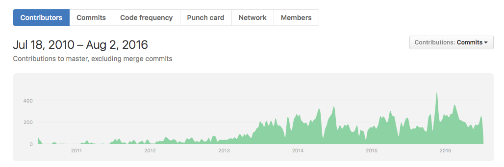
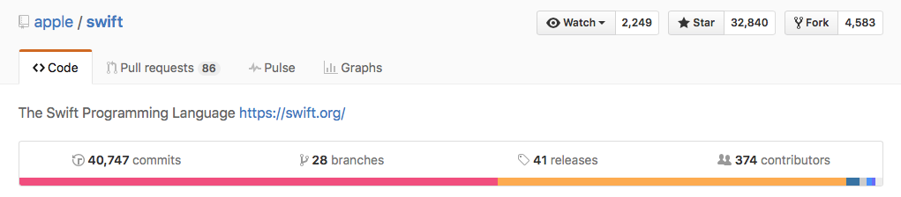
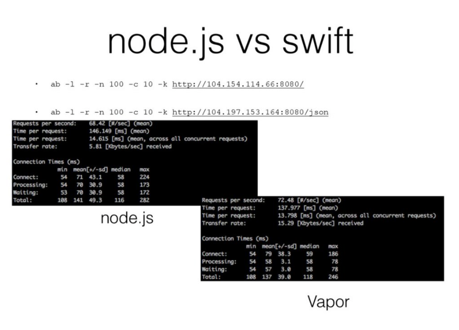

#Swift Server Side

Partiamo un attimo dall'inizio...

##2014
 Apple presente durante la conferenza mondiale degli sviluppatori [wwdc2014](https://developer.apple.com/videos/play/wwdc2014/402/) un nuovo linguaggio di programmazione destinato a sostituire completamente con gli anni il precedente linguaggio (Objective C) utilizzato fino a quel momento per lo sviluppo di programmi all'interno del suo ecosistema (MacOS, iOS, TvOS, watchOS). Il nome scelto per il nuovo linguaggio è **SWIFT** (dall'inglese "rondine", "rapido").

Per consentirne l'adozione rapida, *swift* è stato sin da subito concepito per essere utilizzato a fianco dei vecchi progetti Objective C permettendo la coesistenza in uno stesso progetto sia di Objective C che di *Swift*. Ma questo non era l'unico vantaggio per cui Apple consigliò sin da subito l'uso di questo linguaggio.

Swift può ben definirsi il *risultato di una attenta selezione darwiniana* (in cui l'uomo recita la parte della natura) che è avvenuta negli anni nel campo informatico dei linguaggi di programmazione ...

Da questo confuso e complicato ambiente, fatto da oceani di righe di codice, vulcanici compilatori, di tentativi più o meno riusciti con cui l'uomo ha sin dall'inizio tentato di generare nuove grammatiche che gli consentissero di ottimizzare le sue comunicazioni con le macchine, la selezione darwiniana informatica negli anni ha elevato a soluzioni migliori quelle che attualmente caratterizzano i più recenti e moderni linguaggi di programmazione e *Swift* non è stato da meno entrando in maniera *"rapida"* e dirompente in questo club smart prendendo il meglio delle idee da "Rust", "Haskell", "Ruby, Python, C#, CLU [[2](http://nondot.org/sabre/)]

 

Ma quali caratteristiche darwiniane ha portato con se *Swift* e che secondo le ultime statistiche di stackoverflow (noto sito per tecnici del settore di Q&A) è sempre più prediletto tra le scelte degli sviluppatori di tutto il mondo?[[1]](http://stackoverflow.com/research/developer-survey-2016#technology-most-loved-dreaded-and-wanted)

##Less code

Il codice con swift diventa pù conciso e con una sintassi più naturale per l'uomo che lo rende più facile da leggere e da manutenere. L'inferred type del compilatore rende il codice scritto dallo sviluppatore più pulito e meno soggetto agli errori. Less code significa anche eliminazione del semanticamente insignificante ; (punto e virgola) che per anni ha caratterizzato la natura dei codici compilati.

Tutto ciò e molto altro, senza scendere troppo nel particolare (si potrebbero citare i Generics, le tuple etc), rende swift un linguaggio facile e divertente da usare per lo sviluppatore che può, a seconda delle esigenze, utilizzare paradigmi classici di programmazione come l'imperative programming o quelli un pò più esotici e moderni come il functional programming.

##Progettato per la sicurezza

Swift elimina intere classi di codice non sicuro. Le variabili devono essere sempre inizializzate prima dell'uso e di default gli oggetti non possono mai essere **nil** (il compilatore ne ferma la compilazione). Possono esserci però situazioni dove un valore **nil** è valido ed appropriato. Per queste situazioni, Swift introduce il concetto di Optional che forza lo sviluppatore ad inserire nella sintassi un "?" o un "!" per indicare al compilatore che si è a conoscenza del problema e si è in grado di gestirne le conseguenze in modo sicuro. Tutto ciò e molto altro rende più difficile tutta una pletora di problemi come i crash a runtime se lo sviluppatore segue i dettami del linguaggio.

##Veloce

Sin dall'inizio Swift è stato progettato per essere "rapido" e veloce. Sfruttando il framework di compilazione LLVM di Apple ad alte prestazioni (che estende quello opensource rilasciato dall'università dell'Illinois nel 2000), il codice swift è trasformato in linguaggio macchina  ottimizzato per gli hardware più moderni

##Playground

Una delle novità assolute di questo linguaggio è la presenza di uno strumento chiamato Playground che permette agli sviluppatori di vedere istantaneamente il risultato del codice senza passare dal ciclo classico di compilazione. Infatti il codice scritto con Playground è tradotto in linguaggio macchina al volo e ciò permette un certo grado di interattività tra quello che si scrive e ciò che il codice effetivamente produce durante l'esecuzione. I Playgrounds possono essere creati sia all'interno di un progetto esistente sia come documenti Standalone permettendone l'utilizzo sia in ambito professionale per il testing del codice al volo sia per la didattica.
Le sue caratteristiche infatti, alcune delle quali elencate precedentemente come il less code o il linguaggio naturale utilizzato, lo rendono, meglio di altri linguaggi, ideale strumento di apprendimento alla programmazione.
  
##Open Source
Annunciandolo un anno dopo la sua presentazione, durante il WWDC 2015 Apple rilascia il suo nuovo linguaggio come Open Source, dando così da un lato la possibilità alla comunità di sviluppatori di tutto il mondo di confrontarsi e partecipare alla sua crescita creando un sistema di contributing fatto di pull request, mailing list, reporting bugs e partecipazione diretta nel processo di evoluzione, dall'altro consentendo al linguaggio di essere utilizzato nei più disparati ambiti di applicazione anche quelli che non sono direttamente controllati da Apple. 

Al processo di evoluzione della nuova versione Swift 3 hanno partecipato centinaia di sviluppatori da tutto il mondo. I dati presenti su github parlano chiaro:

Centinaia di contributi, come spiega Chris Lattner Senior Director del Developer Tools Department di Apple [[3]](https://lists.swift.org/pipermail/swift-evolution/Week-of-Mon-20160725/025676.html) in uno degli ultimi messaggi in mailing list in occasione del giro di boa di swift 3 verso swift 4, significano però anche un alto rischio di perdere per strada alcuni obiettivi, ma grazie al fatto che dietro al processo apparentemente caotico dei processi opensource ci sia sempre l'occhio vigile di una grande azienda come la Apple che suggerisce alcuni dei path principali da perseguire rispetto ad altri, questo processo si traduce in concretezza oltre che essere un ottimo esempio di come l'opensource può coesistere con il closed source (ricordiamo che i vari framework di Apple che sono il cuore dei dispositivi mobile come CocoaTouch, SceneKit etc rimangono e rimarranno pur sempre closed source).

#Nuovi Percorsi
Dal momento in cui Swift è stato rilasciato open source e cross-platform, molti team si sono sbizzarriti per rendere Swift non solo un linguaggio di programmazione orientato allo sviluppo in ambiente Apple ma anche un vero e proprio linguaggio Full Stack da utilizzare anche in altri ambiti non legati direttamente ad ambiente Apple. 

Esempi sempre più numerosi si stanno affacciando nel panorama in ambito web. Stanno infatti nascendo diversi framework che permettono di sviluppare interi server web e framework per il backend. Less code, sicurezza, velocità d'esecuzione stanno permettedno a Swift di imporsi anche in ambiti in qualche modo legati al processo di sviluppo delle apps, e l'interessamento di grandi Big del settore in questa evoluzione, come IBM, ne conferma la serietà delle intenzioni.
 Quello di cui parleremo sono tecnologie nuove, ancora poco affrontate e in via di sviluppo ma molto promettenti per il futuro. Ma la prima domanda che forse già vi state facendo da un pezzo  è:
#Perchè utilizzare Swift lato server ?

Esistono già linguaggi creati specificamente per far questo. Pensiamo a Ruby, Go, Php etc.. abbiamo anche già a disposizione numerosi linguaggi cross-platform, pensiamo a Python, C#, Java. Perchè Swift dovrebbe essere *"migliore"* di questi linguaggi che hanno già una maturità e una base di installazioni ragguardevoli?
Beh, perchè semplicemente qui non si vuole sottolineare un discorso di un *"linguaggio migliore"* rispetto a qualche altro. Non esiste un linguaggio migliore in assoluto. Ogni linguaggio ha le sue specificità, ed è stato progettato per un certo compito. Qui si vuole sottolineare il fatto che un linguaggio come swift, nato con un certo scopo, grazie a certe sue caratteristiche peculiari, sta pian piano uscendo dal suo guscio per cui è stato creato e si sta posizionando in ottime posizioni in certi campi di applicazione. Per quale motivo?

##Compromesso
Se comparato ad altri linguaggi, Swift è stato progettato sin dall'inizio per essere un giusto compromesso tra Produttività e Performance.

Alcuni linguaggi di programmazione infatti sono ideali per la produttività degli sviluppatori ma girano lentamente. Altri sono veloci ma per lo sviluppatore risultano difficili da scrivere velocemente.
Swift racchiude in se entrambe le caratteristiche, veloce da scrivere e veloce in fase di run. Produttività e Performance. Dati alla mano allora parliamo di:

##Prestazioni
Dopo il rilascio delle istruzioni per sistemi Linux, alcuni si sono spinti nei test benchmark più disparati.
Uno dei più semplici benchmark fa uso del Apache HTTP server benchmarking tool **ab**.

Come si può apprezzare da una delle slide che [presentazione](https://speakerdeck.com/smithclay/server-side-swift-with-docker-and-kubernetes) Clay Smith, Ingegnere Software, ha presentato allo Swift Mission Meetup del 2016, il server Swift Vapor è nettamente più performante della controparte in nodejs.

In comparazioni tra Go, NodeJS e Rust, Swift risulta molto spesso più performante dei rivali:

[Qui](https://grigio.org/go-vs-node-vs-rust-vs-swift/) nel classico test della serie di fibonacci (chi vuole approfondire può seguire il link), Swift risulta essere quasi il doppio più veloce di Rust, molte volte piu veloce di nodejs e Go.
 

[In un altra comparazione](https://medium.com/@qutheory/server-side-swift-vs-the-other-guys-2-speed-ca65b2f79505#.at98s2bjs) che esamina una delle più comuni attività di un framework web ossia l'SQLite Fetch (ma nel link si trovano altri semplici test usuali per un server web), Swift ( o meglio il framework web Swift Vapor in questo caso) è comparato ad altri linguaggi sia interpretati che compilati (tutti insieme appassionatamente 👨‍👩‍👧‍👧). Dai grafici che ne vengono fuori da queste analisi è possibile apprezzarne di nuovo le prestazioni: come si evince dai tets, Swift risulta essere ben 10 volte più veloce degli altri framework testati e ha tutte le possibilità per detronare i suoi più prossimi rivali, come Go e nodejs, in quanto il compilatore in ambiente Linux (dove sono stati eseguiti questi test) non è ancora completamente ottimizzato per questo ambiente.

##Un unico linguaggio per incatenarli tutti

NodeJs è salito in popolarità perchè consente ai "full-stack developers" di lavorare sia sul frontend che sul backend delle loro web apps. Ciò consente ai team di [iterare](http://searchsoftwarequality.techtarget.com/definition/iteration) più velocemente e questo spesso porta a prodotti di maggior successo. Swift, allo stesso modo di nodejs, grazie alle caratteristiche viste precedentemente diminuisce il tempo di iterazione per i team che lavorano sullo sviluppo mobile.
Un'altra importante considerazione è che utilizzandolo sia su server che su mobile è possibile sfruttare gli stessi modelli per la parte di networking, senza necessariamente doverli riscrivere da linguaggio a linguaggio.

#I Principali Framework Web Swift attuali

Esistono attualmente decine di framework server-side Swift più o meno seguiti e supportati. Alcuni sono nati dalla passione di sviluppatori indipendenti, altri da Team di sviluppo che stanno iniziando a fondare il loro core business su questa materia, altri che hanno abbracciato l'idea di uno Swift lato server sin da subito come IBM. I framework più popolari che stanno salendo attualmente alla ribalta sono: 
#Perfect

#Vapor
 (che si ispira al framework php Laravel)
#Kitura

Sviluppato da IBM il quale sta investendo molte risorse su Swift per renderlo il prossimo grande linguaggio enterprise dopo Java. [Kitura]() è stato presentato [nell'ultimo WWDC16](https://developer.apple.com/videos/play/wwdc2016/415/)

#Zewo
Tutti insieme hanno al loro attivo oltre 15.000 stars su github. Se lo paragoniamo ad esempio a Rails, un framework web molto più consolidato, che ha all'attivo 31.000 stars capiamo subito che le preferenze verso questa soluzione stanno crescendo rapidamente considerando anche il fatto che di Swift Server-Side si è iniziato a parlarne soltanto da un anno. 

#Hello World in Vapor